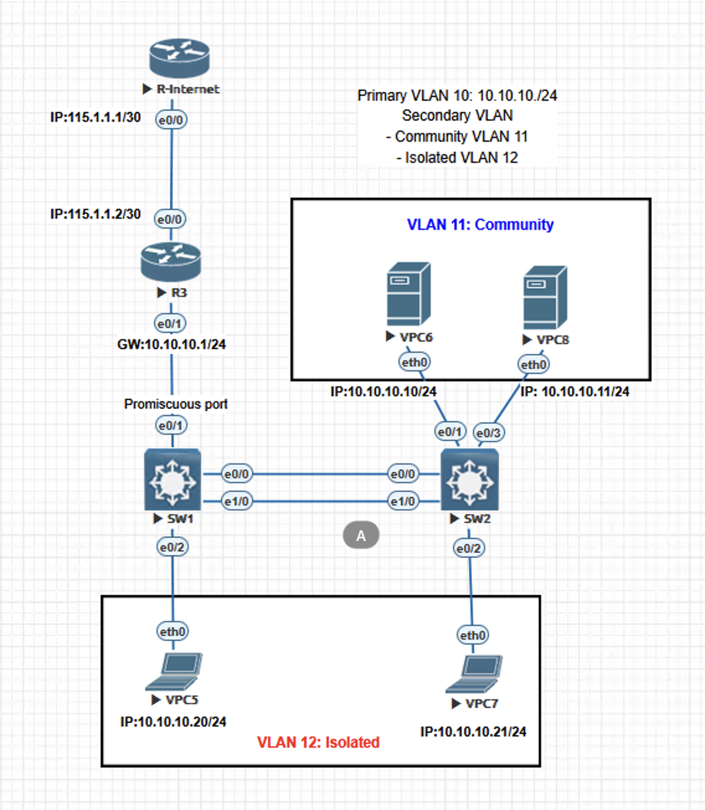

# 🔐 Private VLAN (PVLAN) Lab

> **Lab #02 — Layer 2 Security Series**  
> Demonstrates L2 micro-isolation using Private VLAN across two switches with real Internet reachability simulation.

---

## 📐 Topology



---

## 🗺️ Network Design

### IP Addressing & VLAN Assignment

| Device | Interface | IP Address | Role | PVLAN Port Type |
|--------|-----------|------------|------|-----------------|
| R-Internet | e0/0 | 115.1.1.1/30 | Simulated Internet | — |
| R3 | e0/0 | 115.1.1.2/30 | Uplink to Internet | — |
| R3 | e0/1 | 10.10.10.1/24 | **Gateway (Promiscuous)** | — |
| SW1 | e0/1 | — | Uplink to R3 | **Promiscuous** |
| SW1 | e0/2 | — | VPC5 (Isolated) | **Isolated** |
| SW1 | e0/0 | — | Trunk to SW2 | Trunk |
| SW1 | e1/0 | — | Trunk to SW2 | Trunk |
| SW2 | e0/1 | — | VPC6 (Community) | **Community** |
| SW2 | e0/3 | — | VPC8 (Community) | **Community** |
| SW2 | e0/2 | — | VPC7 (Isolated) | **Isolated** |
| VPC5 | eth0 | 10.10.10.20/24 | Isolated host | — |
| VPC6 | eth0 | 10.10.10.10/24 | Community host | — |
| VPC7 | eth0 | 10.10.10.21/24 | Isolated host | — |
| VPC8 | eth0 | 10.10.10.11/24 | Community host | — |

---

### PVLAN Structure

```
Primary VLAN 10  →  Subnet: 10.10.10.0/24
│
├── Secondary VLAN 11 (Community)
│   ├── VPC6  →  10.10.10.10/24  (SW2 e0/1)
│   └── VPC8  →  10.10.10.11/24  (SW2 e0/3)
│   [VPC6 ↔ VPC8: ALLOWED]
│
└── Secondary VLAN 12 (Isolated)
    ├── VPC5  →  10.10.10.20/24  (SW1 e0/2)
    └── VPC7  →  10.10.10.21/24  (SW2 e0/2)
    [VPC5 ↔ VPC7: BLOCKED]
    [VPC5 ↔ VPC6: BLOCKED]
```

---

### Traffic Matrix

| Source | Destination | Allowed? | Reason |
|--------|-------------|----------|--------|
| VPC6 (Community) | VPC8 (Community) | ✅ Yes | Same community VLAN 11 |
| VPC6 (Community) | R3 Gateway | ✅ Yes | Community → Promiscuous |
| VPC5 (Isolated) | R3 Gateway | ✅ Yes | Isolated → Promiscuous only |
| VPC7 (Isolated) | R3 Gateway | ✅ Yes | Isolated → Promiscuous only |
| VPC5 (Isolated) | VPC7 (Isolated) | ❌ No | Isolated cannot reach Isolated |
| VPC5 (Isolated) | VPC6 (Community) | ❌ No | Isolated cannot reach Community |
| VPC6 (Community) | VPC5 (Isolated) | ❌ No | Community cannot reach Isolated |
| Any VPC | R-Internet | ✅ Yes | Via R3 → R-Internet (routed) |

---

## ⚙️ Device Configurations

### R-Internet

```
! Simulated Internet router
hostname R-Internet
!
interface Ethernet0/0
 ip address 115.1.1.1 30
 no shutdown
!
! Default route pointing back to R3 (for return traffic)
ip route 10.10.10.0 255.255.255.0 115.1.1.2
```

---

### R3 (Gateway Router)

```
hostname R3
!
! Uplink to R-Internet
interface Ethernet0/0
 ip address 115.1.1.2 30
 no shutdown
!
! Gateway interface — Promiscuous side
! R3 acts as the default gateway for all PVLAN hosts
interface Ethernet0/1
 ip address 10.10.10.1 255.255.255.0
 no shutdown
!
ip routing
!
! Default route to Internet
ip route 0.0.0.0 0.0.0.0 115.1.1.1
```

---

### SW1 (Primary PVLAN Switch — Promiscuous Port)

```
hostname SW1
!
! ─── PVLAN VLAN Definitions ───────────────────────────────
vlan 10
 name PRIMARY-VLAN-10
 private-vlan primary
!
vlan 11
 name COMMUNITY-VLAN-11
 private-vlan community
!
vlan 12
 name ISOLATED-VLAN-12
 private-vlan isolated
!
! Associate secondary VLANs to primary
vlan 10
 private-vlan association 11,12
!
! ─── Uplink to R3 — Promiscuous Port ──────────────────────
interface Ethernet0/1
 description UPLINK-TO-R3-GATEWAY
 switchport mode private-vlan promiscuous
 switchport private-vlan mapping 10 11,12
 no shutdown
!
! ─── Downlink to VPC5 — Isolated Port ─────────────────────
interface Ethernet0/2
 description HOST-VPC5-ISOLATED
 switchport mode private-vlan host
 switchport private-vlan host-association 10 12
 no shutdown
!
! ─── Trunk Links to SW2 ────────────────────────────────────
! Two trunk links for redundancy (EtherChannel or dual uplink)
interface Ethernet0/0
 description TRUNK-TO-SW2-LINK1
 switchport trunk encapsulation dot1q
 switchport mode trunk
 switchport trunk allowed vlan 10,11,12
 no shutdown
!
interface Ethernet1/0
 description TRUNK-TO-SW2-LINK2
 switchport trunk encapsulation dot1q
 switchport mode trunk
 switchport trunk allowed vlan 10,11,12
 no shutdown
!
! ─── Security Hardening ────────────────────────────────────
! Disable unused ports
interface range Ethernet0/3, Ethernet1/1-3
 switchport mode access
 switchport access vlan 999
 shutdown
!
! Disable DTP on trunk ports
interface range Ethernet0/0, Ethernet1/0
 switchport nonegotiate
```

---

### SW2 (Secondary PVLAN Switch — Host Ports)

```
hostname SW2
!
! ─── PVLAN VLAN Definitions ───────────────────────────────
! Must mirror SW1 PVLAN config exactly
vlan 10
 name PRIMARY-VLAN-10
 private-vlan primary
!
vlan 11
 name COMMUNITY-VLAN-11
 private-vlan community
!
vlan 12
 name ISOLATED-VLAN-12
 private-vlan isolated
!
vlan 10
 private-vlan association 11,12
!
! ─── Trunk Links to SW1 ────────────────────────────────────
interface Ethernet0/0
 description TRUNK-TO-SW1-LINK1
 switchport trunk encapsulation dot1q
 switchport mode trunk
 switchport trunk allowed vlan 10,11,12
 switchport nonegotiate
 no shutdown
!
interface Ethernet1/0
 description TRUNK-TO-SW1-LINK2
 switchport trunk encapsulation dot1q
 switchport mode trunk
 switchport trunk allowed vlan 10,11,12
 switchport nonegotiate
 no shutdown
!
! ─── Community Ports — VPC6 & VPC8 ────────────────────────
interface Ethernet0/1
 description HOST-VPC6-COMMUNITY
 switchport mode private-vlan host
 switchport private-vlan host-association 10 11
 no shutdown
!
interface Ethernet0/3
 description HOST-VPC8-COMMUNITY
 switchport mode private-vlan host
 switchport private-vlan host-association 10 11
 no shutdown
!
! ─── Isolated Port — VPC7 ─────────────────────────────────
interface Ethernet0/2
 description HOST-VPC7-ISOLATED
 switchport mode private-vlan host
 switchport private-vlan host-association 10 12
 no shutdown
!
! ─── Security Hardening ────────────────────────────────────
interface range Ethernet1/1-3
 switchport mode access
 switchport access vlan 999
 shutdown
```

---

### VPC Host Configuration

```bash
# VPC5 — Isolated
ip 10.10.10.20 255.255.255.0 10.10.10.1

# VPC6 — Community
ip 10.10.10.10 255.255.255.0 10.10.10.1

# VPC7 — Isolated
ip 10.10.10.21 255.255.255.0 10.10.10.1

# VPC8 — Community
ip 10.10.10.11 255.255.255.0 10.10.10.1
```

---

## ✅ Verification Commands

### Verify PVLAN Configuration

```
! Kiểm tra PVLAN association
SW1# show vlan private-vlan

Primary Secondary Type              Ports
------- --------- ----------------- ------------------------------------------
10      11        community         Et0/0, Et0/1, Et1/0, Et0/1(SW2), Et0/3(SW2)
10      12        isolated          Et0/0, Et0/1, Et1/0, Et0/2, Et0/2(SW2)

! Kiểm tra port mode
SW1# show interfaces ethernet0/1 switchport
Administrative Mode: private-vlan promiscuous
Operational Mode: private-vlan promiscuous
Private-vlan: mapping 10 (primary) 11, 12 (secondary)

SW2# show interfaces ethernet0/1 switchport
Administrative Mode: private-vlan host
Operational Mode: private-vlan host
Private-vlan: host-association 10 (primary) 11 (secondary)

! Kiểm tra trunk
SW1# show interfaces trunk
SW1# show vlan brief
```

### Verify Traffic Matrix (Ping Tests)

```bash
# ✅ TEST 1: Community → Community (PHẢI PASS)
VPC6> ping 10.10.10.11      # VPC6 → VPC8
!!! Expected: Success

# ✅ TEST 2: Isolated → Gateway (PHẢI PASS)
VPC5> ping 10.10.10.1       # VPC5 → R3
!!! Expected: Success

# ✅ TEST 3: Community → Gateway (PHẢI PASS)
VPC6> ping 10.10.10.1       # VPC6 → R3
!!! Expected: Success

# ✅ TEST 4: Any → Internet (PHẢI PASS)
VPC5> ping 115.1.1.1        # VPC5 → R-Internet
!!! Expected: Success

# ❌ TEST 5: Isolated → Isolated (PHẢI FAIL)
VPC5> ping 10.10.10.21      # VPC5 → VPC7
!!! Expected: Timeout (blocked by PVLAN)

# ❌ TEST 6: Isolated → Community (PHẢI FAIL)
VPC5> ping 10.10.10.10      # VPC5 → VPC6
!!! Expected: Timeout (blocked by PVLAN)

# ❌ TEST 7: Community → Isolated (PHẢI FAIL)
VPC6> ping 10.10.10.20      # VPC6 → VPC5
!!! Expected: Timeout (blocked by PVLAN)
```

---

## 🔧 Troubleshooting

### Issue 1 — Isolated host không ping được Gateway

**Triệu chứng:** VPC5 ping 10.10.10.1 timeout

```
! Kiểm tra port mode đúng chưa
SW1# show interfaces e0/2 switchport
→ Phải là: private-vlan host / host-association 10 12

! Kiểm tra promiscuous mapping có include VLAN 12 chưa
SW1# show interfaces e0/1 switchport
→ Phải là: mapping 10 11,12  (không phải chỉ 11)

! Fix nếu thiếu VLAN 12 trong mapping
SW1(config)# interface e0/1
SW1(config-if)# switchport private-vlan mapping 10 add 12
```

---

### Issue 2 — Community hosts không ping được nhau qua 2 switch

**Triệu chứng:** VPC6 (SW2) ping VPC8 (SW2) OK, nhưng nếu VPC6 và VPC8 ở hai switch khác nhau thì fail

```
! Kiểm tra trunk có allow VLAN 11 không
SW1# show interfaces trunk
→ VLANs allowed: phải có 10, 11, 12

! Fix nếu VLAN 11 không có trong trunk
SW1(config)# interface e0/0
SW1(config-if)# switchport trunk allowed vlan add 11
```

---

### Issue 3 — PVLAN không hoạt động sau khi thêm SW2

**Triệu chứng:** Mọi thứ OK trên SW1 nhưng host trên SW2 không hoạt động đúng

```
! Nguyên nhân: SW2 thiếu PVLAN VLAN definition
! PVLAN config phải được mirror trên TẤT CẢ switch trong domain

SW2# show vlan private-vlan
→ Nếu trống: SW2 chưa có PVLAN config

! Fix: Thêm PVLAN definition lên SW2 (xem config SW2 ở trên)
! Lưu ý: VTP v2 KHÔNG sync PVLAN → phải cấu hình thủ công
```

---

### Issue 4 — ARP không resolve được cho Isolated host

**Triệu chứng:** Ping timeout dù đúng config, debug ARP không thấy reply

```
! Nguyên nhân: Router R3 cần proxy-arp để reply cho isolated hosts
! Vì isolated host không thể ARP broadcast sang host khác

R3(config)# interface e0/1
R3(config-if)# ip proxy-arp          ! thường enabled by default

! Kiểm tra
R3# show ip interface e0/1 | include proxy
  Proxy ARP is enabled
```

---

## 📚 Key Concepts Summary

| Concept | Detail |
|---------|--------|
| **Primary VLAN** | VLAN 10 — container chứa tất cả hosts trong subnet 10.10.10.0/24 |
| **Community VLAN 11** | Hosts giao tiếp được với nhau + gateway |
| **Isolated VLAN 12** | Hosts CHỈ giao tiếp với gateway, không reach bất kỳ host nào khác |
| **Promiscuous Port** | Port duy nhất có thể nhận traffic từ tất cả secondary VLAN |
| **PVLAN Trunk** | Phải allow primary + tất cả secondary VLAN, config mirror cả 2 switch |
| **Proxy ARP** | R3 cần proxy-arp để handle ARP cho isolated hosts |

---

## 🔗 Related Labs

- [← VLAN Lab (Lab #01)](../VLAN/README.md)
- [→ VTP Lab (Lab #03)](../VTP/README.md)
- [→ DHCP Snooping (Lab #10)](../DHCP-Snooping/README.md) — thường triển khai cùng PVLAN
- [→ DAI (Lab #11)](../DAI/README.md) — bộ ba bảo mật L2: PVLAN + DHCP Snooping + DAI

---

*Lab #02 · L2 Security Series · David Du — Network Labs*
